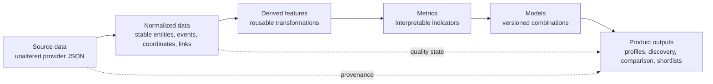

# Data documentation

This section records what the audited StatsBomb Open Data snapshot contains, how
ScoutLabs may use it, and which limitations must remain visible. Facts described as
**Documented** come from the official specifications. Facts described as **Observed**
come from the complete local audit identified in the
[coverage report](coverage-report.md). Proposed transformations and metrics are not
implemented product capabilities.

## Data layers

- **Source data** is the immutable provider snapshot: competitions, matches,
  lineups, events, and 360 frames.
- **Normalized data** is a proposed consistent internal representation. It must
  preserve provider values and provenance; no normalized store exists yet.
- **Derived features** are proposed reusable calculations such as coordinate
  progression, zone entry, or sequence participation.
- **Metrics** answer named football questions with explicit numerators,
  denominators, units, populations, and limitations.
- **Models** combine versioned features or metrics, for example a proposed
  similarity baseline. No production analytical model exists yet.
- **Product outputs** are future user-facing profiles, searches, comparisons,
  explanations, and shortlists defined by the [product brief](../../BRIEF.md).

## Documents

- [Source data dictionary](source-data-dictionary.md) — documented and observed
  fields, types, occurrence counts, coverage, relationships, and caveats.
- [Field-utilization matrix](field-utilization-matrix.md) — one classified
  decision row for every Source ID in the dictionary.
- [Coverage report](coverage-report.md) — reproducible measurements for the
  complete local snapshot.
- [Event taxonomy](event-taxonomy.md) — every documented or observed event type,
  its context, analytical opportunities, and risks.
- [Data-quality rules](data-quality-rules.md) — versioned detection and response
  rules.
- [Feature lineage](feature-lineage.md) — canonical proposed feature registry and
  source-to-product lineage.

## Evidence and status conventions

Availability uses only: **Documented**, **Observed**, **Documented and observed**,
**Documented but not observed**, and **Observed but not documented**. Completed
checks appear in
[validation results](../research/validation-results.md); proposals and planned
experiments are kept separate.

StatsBomb is the source of the Open Data files. See the external repository's
terms and attribution notice before publishing derived analysis.
