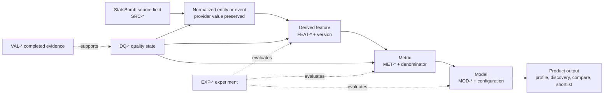
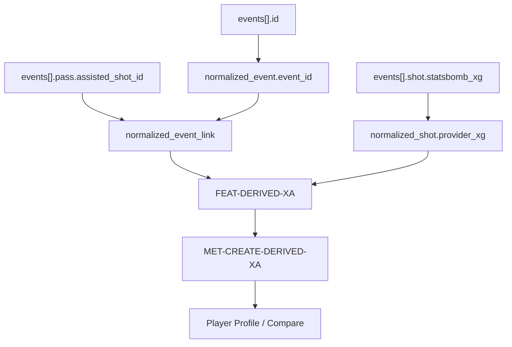

# Canonical feature registry and lineage

**Registry version:** 0.1.0  
**Implementation state:** no feature in this document is implemented in the
production application  
**Default analytical unit:** player-team-season, subject to R1 and the
[similarity research plan](../research/similarity-research.md)

Features are reusable transformations, not automatically user-facing metrics.
Provider-supplied values remain identified as such. A feature marked
**Researching** has unresolved definitions or validation gates; **Proposed**
means specified for future implementation but not admitted.

## Layer lineage

## Common contracts

- Coordinates use the provider 120-by-80 pitch and a versioned common
  attack-direction representation. Source values are never overwritten.
- Missing source fields are **unknown/not applicable**, never zero.
- Period 5 is excluded from ordinary playing-time and on-pitch action metrics.
- Per-90 values are metrics over `FEAT-MINUTES`; feature rows retain raw counts
  or seconds.
- Minimum coverage below means the minimum structural evidence, not a final
  player-eligibility threshold. Thresholds remain experiments.
- `MET-*` and `MOD-*` consumers are candidates only; consult the
  [metric catalogue](../metrics/metric-catalog.md) and
  [model card](../metrics/model-cards/similarity-baseline-v0-proposal.md).

## Availability and position features

| Feature ID | Name and football question | Source field IDs and JSON paths | Event families | Transformation | Unit; granularity; denominator | Null handling and minimum coverage | Quality dependencies | Metric consumers | Model consumers | Product consumers | Status; version | Limitations |
|---|---|---|---|---|---|---|---|---|---|---|---|---|
| FEAT-APPEARANCE | Appearance — did the player participate? | SRC-LINEUP-PLAYER-ID `lineups[].lineup[].player_id`; SRC-EVENT-TACTICS-LINEUP `events[].tactics.lineup[]`; SRC-SUBSTITUTION-REPLACEMENT-ID `events[].substitution.replacement.id`; SRC-EVENT-BASE-PLAYER-ID `events[].player.id` | Lineup, Starting XI, Substitution, Player On | Union consistent participation evidence per player/team/match; retain evidence flags. | Boolean/count; player-team-match then season; valid matches | Unknown on contradictory or missing lineup/event evidence; require a valid match and at least one consistent participation source. | DQ-FILE-MISSING, DQ-LINEUP-CONSISTENCY, DQ-STARTING-XI-CONSISTENCY, DQ-SUBSTITUTION-CONSISTENCY | MET-AVAIL-APPEARANCES | MOD-SIM-BASELINE-V0 eligibility | Player Profile, Player Explorer, Compare | Proposed; v0.1.0 | Team-sheet presence alone may not prove participation; evidence precedence requires EXP-MIN-001. |
| FEAT-START | Start — was the player in the initial XI? | SRC-EVENT-TACTICS-LINEUP `events[].tactics.lineup[].player.id`; observed lineup position `start_reason` | Starting XI, lineup positions | Player appears once in the team’s valid first-period Starting XI; reconcile with observed `positions[].start_reason`. | Boolean/count; player-team-match then season; valid team-match | Unknown when Starting XI is missing/inconsistent; require one valid Starting XI per team. | DQ-STARTING-XI-CONSISTENCY, DQ-LINEUP-CONSISTENCY | MET-AVAIL-STARTS | MOD-SIM-BASELINE-V0 eligibility | Player Profile, Compare | Proposed; v0.1.0 | Re-starts around unusual periods or incomplete video need explicit handling. |
| FEAT-MINUTES | Player minutes — how long was the player on the pitch? | SRC-EVENT-BASE-PERIOD `events[].period`; SRC-EVENT-BASE-TIMESTAMP `events[].timestamp`; Starting XI, Substitution, Player On/Off, cards, Half End; observed `lineups[].lineup[].positions[]` intervals | Match administration, lineup and tactics | Candidate: construct period-aware participation intervals in seconds and reconcile them with provider-observed lineup position intervals; exclude shootout time. | Seconds; player-team-match then season; actual playable period time | Unknown on unresolved conflict; never assume every match is 90 minutes; require validated period endpoints and participation states. | DQ-STARTING-XI-CONSISTENCY, DQ-SUBSTITUTION-CONSISTENCY, DQ-PLAYER-ON-OFF, DQ-PERIOD-BOUNDARY, DQ-STOPPAGE-TIME, DQ-EXTRA-TIME, DQ-SHOOTOUT, DQ-DISMISSAL, DQ-INCOMPLETE-VIDEO | MET-AVAIL-MINUTES and every per-90 metric | MOD-SIM-BASELINE-V0 eligibility/reliability | All analytical surfaces | Researching; v0.1.0 | No final algorithm is selected; EXP-MIN-001 must resolve dismissal, interruption, extra-time, and position-interval anomalies. |
| FEAT-MINUTES-BY-POSITION | Minutes by position — where was participation recorded? | lineup `positions[].position_id`, `from`, `to`, `from_period`, `to_period`; SRC-EVENT-BASE-POSITION-ID `events[].position.id`; tactics lineups | Lineup and tactics | Intersect validated participation intervals with non-overlapping provider position intervals; retain event-time position distribution as corroboration, not a replacement. | Seconds/share; player-team-match/season; FEAT-MINUTES | Unknown for overlapping/reversed intervals; require validated minutes and position evidence. | DQ-POSITION-INTERVAL, DQ-PLAYER-ON-OFF, DQ-STARTING-XI-CONSISTENCY | Position-share candidates | MOD-SIM-BASELINE-V0 population | Similar Players, Player Profile, Compare | Researching; v0.1.0 | Source position is not a complete tactical role; observed intervals contain edge cases requiring reconciliation. |

## Passing, progression, carrying, and loss features

| Feature ID | Name and football question | Source field IDs and JSON paths | Event families | Transformation | Unit; granularity; denominator | Null handling and minimum coverage | Quality dependencies | Metric consumers | Model consumers | Product consumers | Status; version | Limitations |
|---|---|---|---|---|---|---|---|---|---|---|---|---|
| FEAT-PASS-ATTEMPT | Pass attempt — how often did the player attempt a provider Pass? | SRC-EVENT-BASE-TYPE-ID `events[].type.id`; SRC-EVENT-BASE-PLAYER-ID `events[].player.id` | Pass | Count valid type ID 30 player events; preserve pass type and period exclusions for metric-specific filters. | Count; player-team-match/season; eligible on-pitch events | Exclude malformed/missing actor; require event file and valid type. | DQ-EVENT-TYPE-OBJECT, DQ-ID-MISSING, DQ-SHOOTOUT | Pass attempts and rate denominators | MOD-SIM-BASELINE-V0 | Player Profile, Player Explorer, Metric Leaders, Compare | Proposed; v0.1.0 | A provider Pass is an intended teammate pass and not every ball movement. |
| FEAT-PASS-COMPLETED | Completed pass — did a pass avoid a provider failure outcome? | SRC-PASS-OUTCOME-ID `events[].pass.outcome.id`; SRC-PASS-TYPE-ID `events[].pass.type.id` | Pass | Candidate outcome rule: missing `pass.outcome` means completed; explicitly decide treatment of Injury Clearance, Unknown, offside, and special types in EXP-PASS-001. | Boolean/count; pass/player season; FEAT-PASS-ATTEMPT | Unknown for unrecognized outcome; require pass object and admitted outcome taxonomy. | DQ-CONDITIONAL-FIELD, DQ-EVENT-TYPE-OBJECT | MET-PASS-COMPLETED, MET-PASS-COMPLETION-RATE | MOD-SIM-BASELINE-V0 | Player Profile, Compare, Metric Leaders | Researching; v0.1.0 | Provider convention and product denominator alternatives are contested. |
| FEAT-PASS-COMPLETION-RATE | Pass completion feature — what share of admitted attempts completed? | FEAT-PASS-COMPLETED; FEAT-PASS-ATTEMPT | Pass | Completed admitted passes / admitted attempts; expose both counts. | Ratio; player-team-season; admitted attempts | Null when denominator is zero or outcome taxonomy unresolved; minimum denominator is EXP-PASS-001. | DQ-CONDITIONAL-FIELD | MET-PASS-COMPLETION-RATE | MOD-SIM-BASELINE-V0 | Player Profile, Compare | Researching; v0.1.0 | A rate is not reliability-adjusted and depends on pass mix/team context. |
| FEAT-FORWARD-PASS | Forward pass — did the pass move goalward? | SRC-EVENT-BASE-LOCATION `events[].location`; SRC-PASS-END-LOCATION `events[].pass.end_location`; SRC-PASS-ANGLE | Pass | After direction normalization, `end_x - start_x > threshold`; compare zero and minimum-advance alternatives. | Boolean/count; pass/player season; passes with valid start/end | Unknown without valid coordinates; require admitted direction/threshold version. | DQ-COORD-SHAPE, DQ-COORD-RANGE | Candidate forward-pass metrics | MOD-SIM-BASELINE-V0 | Player Profile, Compare | Researching; v0.1.0 | Tiny positive x changes may not be footballistically forward; threshold unresolved. |
| FEAT-PASS-X-PROGRESSION | Pass progression — how much closer to goal did the pass travel? | SRC-EVENT-BASE-LOCATION; SRC-PASS-END-LOCATION | Pass | Direction-normalized x change and/or reduction in Euclidean distance to opponent goal; store both primitives. | StatsBomb coordinate units; pass; valid-coordinate passes | Unknown if either location invalid; no imputation. | DQ-COORD-SHAPE, DQ-COORD-RANGE | MET-PROG-PASSES inputs | MOD-SIM-BASELINE-V0 | Player Profile, maps, internal research | Proposed primitive; v0.1.0 | Coordinate units are provider pitch units; not metres without an explicit conversion. |
| FEAT-PROGRESSIVE-PASS | Progressive pass — did a pass meet the selected progression rule? | FEAT-PASS-X-PROGRESSION; SRC-PASS-TYPE-ID | Pass | Compare Wyscout-style 30/15/10 goal-distance reduction, fixed advance, zone advance, and later xT gain; select only after EXP-PROG-001. | Boolean/count; pass/player season; eligible valid-coordinate passes | Unknown without coordinates; exclude set-piece/special types only if the chosen definition says so. | DQ-COORD-SHAPE, DQ-COORD-RANGE, DQ-CONDITIONAL-FIELD | MET-PROG-PASSES | MOD-SIM-BASELINE-V0 | Similar Players, Player Profile, Metric Leaders, Compare | Researching; v0.1.0 | No native StatsBomb progressive flag; alternatives are not interchangeable. |
| FEAT-FINAL-THIRD-ENTRY | Final-third entry — did an action move the ball from outside to inside x ≥ 80? | Event start and Pass/Carry end locations | Pass, Carry | Direction normalize; start x < 80 and end x ≥ 80; version boundary policy. | Boolean/count; action/player season; eligible passes/carries | Unknown without valid start/end; minimum one eligible action. | DQ-COORD-SHAPE, DQ-COORD-RANGE | MET-PROG-FINAL-THIRD-ENTRIES | MOD-SIM-BASELINE-V0 | Player Profile, Metric Leaders, action maps | Proposed; v0.1.0 | Does not prove the next touch retained possession unless a retention variant is specified. |
| FEAT-PENALTY-AREA-ENTRY | Penalty-area entry — did an action enter the opponent box from outside? | Event start and Pass/Carry end locations | Pass, Carry | Direction normalize; origin outside and end inside documented box (`x ≥ 102`, `18 ≤ y ≤ 62`) using a versioned boundary rule. | Boolean/count; action/player season; eligible passes/carries | Unknown without valid coordinates. | DQ-COORD-SHAPE, DQ-COORD-RANGE | MET-PROG-PENALTY-AREA-ENTRIES | MOD-SIM-BASELINE-V0 | Player Profile, Metric Leaders, action maps | Proposed; v0.1.0 | A geometric entry is not automatically a successful receipt or chance. |
| FEAT-CARRY | Carry — how often did a player control the ball while moving or standing? | SRC-EVENT-BASE-TYPE-ID; SRC-CARRY-END-LOCATION `events[].carry.end_location`; event start location | Carry | Count valid type ID 43; retain start/end geometry. | Count; player-team-match/season; valid carry events | Exclude malformed carry object from spatial derivatives, retain event count if identity/type valid. | DQ-EVENT-TYPE-OBJECT, DQ-CONDITIONAL-FIELD | Carry volume metrics | MOD-SIM-BASELINE-V0 | Player Profile, maps | Proposed; v0.1.0 | Carry does not mean successful take-on; zero-distance carries may be legitimate control. |
| FEAT-CARRY-X-PROGRESSION | Carry progression — how far goalward did a carry move? | SRC-EVENT-BASE-LOCATION; SRC-CARRY-END-LOCATION | Carry | Same normalized primitive alternatives as pass progression. | StatsBomb coordinate units; carry | Unknown without valid start/end. | DQ-COORD-SHAPE, DQ-COORD-RANGE | MET-PROG-CARRIES inputs | MOD-SIM-BASELINE-V0 | Player Profile, maps, internal research | Proposed primitive; v0.1.0 | Event endpoints do not reproduce the continuous path taken. |
| FEAT-PROGRESSIVE-CARRY | Progressive carry — did a carry meet a selected rule? | FEAT-CARRY-X-PROGRESSION | Carry | Compare 30/15/10 goal-distance, fixed advance, zone advance, and xT gain in EXP-PROG-001. | Boolean/count; carry/player season; valid-coordinate carries | Unknown without coordinates; no zero filling. | DQ-COORD-SHAPE, DQ-COORD-RANGE | MET-PROG-CARRIES | MOD-SIM-BASELINE-V0 | Similar Players, Player Profile, Metric Leaders, Compare | Researching; v0.1.0 | No provider progressive-carry flag and no final rule selected. |
| FEAT-DRIBBLE-ATTEMPT | Dribble attempt — did the player attempt to beat an opponent? | SRC-EVENT-BASE-TYPE-ID; SRC-DRIBBLE-OUTCOME-ID `events[].dribble.outcome.id` | Dribble | Count valid type ID 14. | Count; player-team-match/season; valid dribble events | Exclude malformed actor/type; outcome may remain unknown for success feature. | DQ-EVENT-TYPE-OBJECT | Dribble attempt/rate candidates | MOD-SIM-BASELINE-V0 | Player Profile, Compare | Proposed; v0.1.0 | Dribbles are take-ons, not every movement with the ball. |
| FEAT-DRIBBLE-SUCCESS | Successful dribble — did provider outcome equal Complete? | SRC-DRIBBLE-OUTCOME-ID | Dribble | Outcome ID/name mapping to Complete; retain attempt denominator. | Boolean/count; dribble/player season; FEAT-DRIBBLE-ATTEMPT | Unknown for missing/unrecognized outcome. | DQ-CONDITIONAL-FIELD | Dribble success metrics | MOD-SIM-BASELINE-V0 | Player Profile, Compare | Proposed; v0.1.0 | Dribbled Past is not a complete symmetric denominator. |
| FEAT-BALL-LOSS | Ball loss — which player event ended or materially lost control? | Dispossessed, Miscontrol, incomplete Dribble, selected Pass outcomes, possession/order evidence | Ball movement and control | Compare narrow (Dispossessed + Miscontrol), action-failure, and possession-ending taxonomies in EXP-LOSS-001; never double count related events. | Boolean/count; event/player season; eligible on-ball actions or possessions | Unknown on ambiguous possession boundary; report taxonomy version. | DQ-REL-UNRESOLVED, DQ-POSSESSION-TEAM, DQ-EVENT-INDEX-ORDER | Loss/security metric candidates | MOD-SIM-BASELINE-V0 | Player Profile, Metric Leaders, Compare | Researching; v0.1.0 | Attribution and denominator are contested; not every failed action equals the same football cost. |

## Creation, shooting, defending, and goalkeeper features

| Feature ID | Name and football question | Source field IDs and JSON paths | Event families | Transformation | Unit; granularity; denominator | Null handling and minimum coverage | Quality dependencies | Metric consumers | Model consumers | Product consumers | Status; version | Limitations |
|---|---|---|---|---|---|---|---|---|---|---|---|---|
| FEAT-SHOT-ASSIST | Shot assist — did a qualifying pass directly assist a shot? | SRC-PASS-SHOT-ASSIST; SRC-PASS-GOAL-ASSIST; SRC-PASS-ASSISTED-SHOT-ID; SRC-SHOT-KEY-PASS-ID | Pass, Shot | Resolve pass↔shot UUIDs; candidate includes both shot-assist and goal-assist flags so scoring shots are not omitted; audit edge cases. | Boolean/count; pass/player season; admitted passes | Unknown for inconsistent/unresolved link; preserve direct flags separately. | DQ-PASS-SHOT-LINK, DQ-REL-UNRESOLVED | MET-CREATE-SHOT-ASSISTS | MOD-SIM-BASELINE-V0 | Player Profile, Metric Leaders, Compare | Researching; v0.1.0 | “Key pass” and “shot assist” are not universal synonyms. |
| FEAT-DERIVED-XA | Derived expected assist — how much linked provider shot xG did a pass create? | FEAT-SHOT-ASSIST; SRC-SHOT-XG `events[].shot.statsbomb_xg` | Pass, Shot | Sum provider StatsBomb xG for uniquely resolved eligible assisted shots; do not call this provider xA. | Probability sum; pass/player season; resolved assisted shots | Unknown for unresolved links or missing xG; never set missing xG to zero. | DQ-PASS-SHOT-LINK, DQ-CONDITIONAL-FIELD | MET-CREATE-DERIVED-XA | MOD-SIM-BASELINE-V0 | Player Profile, Metric Leaders, Compare | Researching; v0.1.0 | Reflects provider pre-shot xG and chosen assist/link taxonomy; EXP-XA-001 required. |
| FEAT-SHOT | Shot — did a player attempt a provider Shot? | SRC-EVENT-BASE-TYPE-ID; shot object | Shot | Count valid type ID 16 outside period 5 for ordinary metrics. | Count; player-team-match/season; eligible events | Exclude invalid actor/type; retain period 5 only in separate shootout analysis. | DQ-EVENT-TYPE-OBJECT, DQ-SHOOTOUT | Shot metrics | MOD-SIM-BASELINE-V0 | Player Profile, maps, Metric Leaders | Proposed; v0.1.0 | Own goals have separate event types and are not Shot events. |
| FEAT-NON-PENALTY-SHOT | Non-penalty shot — was a shot not type Penalty? | SRC-SHOT-TYPE-ID `events[].shot.type.id`; FEAT-SHOT | Shot | Exclude provider shot type ID 88 Penalty; define missing type policy through audit. | Boolean/count; shot/player season; eligible shots | Unknown if shot type missing/unrecognized; do not assume open play. | DQ-CONDITIONAL-FIELD | MET-SHOOT-NON-PENALTY-SHOTS | MOD-SIM-BASELINE-V0 | Player Profile, Metric Leaders, Compare | Proposed; v0.1.0 | Direct free kicks and other set plays remain non-penalty. |
| FEAT-SHOT-XG | Provider shot xG — what pre-shot probability did StatsBomb assign? | SRC-SHOT-XG | Shot | Preserve numeric provider value with source/version; aggregate only after validity check. | Probability; shot | Unknown when missing/invalid; require `[0,1]` and provider version metadata. | DQ-CONDITIONAL-FIELD, DQ-PROVIDER-VERSION | xG metrics, FEAT-DERIVED-XA | MOD-SIM-BASELINE-V0 | Player Profile, shot maps | Proposed provider value; v0.1.0 | ScoutLabs did not train or validate StatsBomb’s proprietary xG model. |
| FEAT-NON-PENALTY-XG | Non-penalty xG — how much provider xG came from non-penalty shots? | FEAT-NON-PENALTY-SHOT; FEAT-SHOT-XG | Shot | Sum valid provider xG over admitted non-penalty shots. | Probability sum; player-team-season; non-penalty shots | Null if the eligible shot set contains unresolved required xG under the selected completeness policy. | DQ-CONDITIONAL-FIELD, DQ-PROVIDER-VERSION | MET-SHOOT-NON-PENALTY-XG | MOD-SIM-BASELINE-V0 | Player Profile, Metric Leaders, Compare | Proposed; v0.1.0 | Context-, era-, and provider-model dependent; not finishing quality by itself. |
| FEAT-PRESSURE | Recorded pressure — how often did the player perform a provider Pressure event? | SRC-EVENT-BASE-TYPE-ID; SRC-EVENT-BASE-DURATION; SRC-EVENT-BASE-LOCATION | Pressure | Count valid type ID 17; retain location/duration and provider version. | Count/seconds; player-team-match/season; valid pressure events | Count identity-valid pressure even if spatial detail invalid; spatial derivative becomes null. | DQ-EVENT-TYPE-OBJECT, DQ-CONDITIONAL-FIELD, DQ-PROVIDER-VERSION | MET-PRESS-PRESSURES | MOD-SIM-BASELINE-V0 | Player Profile, pressure maps, Metric Leaders | Proposed; v0.1.0 | Recorded event activity is not continuous pressing intensity or team shape. |
| FEAT-COUNTERPRESS | Counterpress-tagged action — was a defensive action tagged within provider’s post-turnover window? | SRC-EVENT-BASE-COUNTERPRESS `events[].counterpress` | Pressure, Dribbled Past, 50/50, Duel, Block, Interception, non-offensive Foul Committed | Count explicit true flags by admitted family; absence means false only where the field is documented true-only and event version supports it. | Boolean/count; event/player season; eligible defensive actions | Unknown under unsupported data version or incompatible event type. | DQ-CONDITIONAL-FIELD, DQ-PROVIDER-VERSION | MET-PRESS-COUNTERPRESS-ACTIONS | MOD-SIM-BASELINE-V0 | Player Profile, Metric Leaders, action maps | Proposed; v0.1.0 | Provider event proxy, not tracking-derived counterpressing intensity; the specification presents it as event-conditional while the observed JSON path is top-level. |
| FEAT-BALL-RECOVERY | Ball recovery — was a provider recovery successful under the selected rule? | SRC-BALL-RECOVERY-FAILURE `events[].ball_recovery.recovery_failure`; event type/player/location | Ball Recovery | Count type ID 2; candidate success is absence of explicit true failure; retain offensive flag separately. | Boolean/count; recovery/player season; recovery attempts | Unknown when object semantics/version cannot be established. | DQ-EVENT-TYPE-OBJECT, DQ-CONDITIONAL-FIELD | MET-DEF-BALL-RECOVERIES | MOD-SIM-BASELINE-V0 | Player Profile, maps, Metric Leaders | Researching; v0.1.0 | A recorded loose-ball recovery is not every regain; EXP-DEF-001 must set taxonomy. |
| FEAT-INTERCEPTION | Interception — did a provider interception satisfy the selected success taxonomy? | SRC-INTERCEPTION-OUTCOME-ID; Pass type Interception | Interception, Pass | Audit event outcomes plus one-touch Pass type 64; keep attempts and successful variants distinct. | Boolean/count; event/player season; eligible interception evidence | Unknown for missing/unrecognized outcomes. | DQ-CONDITIONAL-FIELD, DQ-EVENT-TYPE-OBJECT | MET-DEF-INTERCEPTIONS | MOD-SIM-BASELINE-V0 | Player Profile, maps, Metric Leaders | Researching; v0.1.0 | Provider documentation says complete interception definition may span two event representations. |
| FEAT-AERIAL-DUEL | Aerial-duel evidence — which recorded event represents a player's participation in an aerial contest? | SRC-EVENT-BASE-TYPE-ID; SRC-EVENT-BASE-PLAYER-ID; SRC-EVENT-BASE-TEAM-ID; SRC-DUEL-TYPE-ID `events[].duel.type.id`; SRC-DUEL-OUTCOME-ID `events[].duel.outcome.id` | Duel and documented aerial qualifiers | Compare a narrow Duel-type taxonomy with a deduplicated taxonomy that may later admit provider aerial-won qualifiers; retain source event and outcome rather than inferring an unrecorded opponent event. | Boolean/count; event/player season; eligible aerial evidence | Unknown for missing actor/type/outcome; no contest denominator until EXP-DEF-001 selects and validates a taxonomy. | DQ-ID-MISSING, DQ-ID-TYPE, DQ-EVENT-TYPE-OBJECT, DQ-CONDITIONAL-FIELD, DQ-REL-ASYMMETRIC | MET-AERIAL-DUELS | None until the taxonomy and stability gates are passed | Player Profile, Player Explorer, Compare, internal research | Proposed; v0.1.0 | Provider families can represent winners and losers asymmetrically; naive unions can double count contests. |
| FEAT-DEFENSIVE-ACTION-HEIGHT | Defensive-action height — where were recorded interventions made? | Event start locations for versioned set of Pressure, Ball Recovery, Interception, Duel/Tackle, Clearance, Block | Defensive interventions | Direction normalize and aggregate named event-family x distributions; median preferred candidate, mean retained. | Coordinate x; player-team-season; valid located admitted defensive actions | Null below selected action count or on invalid locations. | DQ-COORD-SHAPE, DQ-COORD-RANGE, DQ-CONDITIONAL-FIELD | Defensive-height candidates | MOD-SIM-BASELINE-V0 | Player Profile, Compare, action maps | Researching; v0.1.0 | Describes event activity, not continuous defensive position. |
| FEAT-GK-SHOT-FACED | Goalkeeper shot faced — which opponent shots link to the goalkeeper? | SRC-GK-TYPE-ID; SRC-GK-OUTCOME-ID; SRC-SHOT-OUTCOME-ID; related events | Shot, Goal Keeper | Resolve compatible opposing Shot↔Goal Keeper pairs; deduplicate multiple relationship edges and define on/off-target variants. | Boolean/count; shot/GK season; eligible resolved shots | Unknown for unresolved/ambiguous links. | DQ-SHOT-GK-LINK, DQ-REL-UNRESOLVED | Goalkeeper shots-faced candidates | Goalkeeper-specific candidate | Player Profile, Compare | Researching; v0.1.0 | Provider goalkeeper taxonomy is complex; team defence and shot selection drive exposure. |
| FEAT-GK-XG-FACED | Goalkeeper pre-shot xG faced — how much provider chance quality did linked shots carry? | FEAT-GK-SHOT-FACED; SRC-SHOT-XG | Shot, Goal Keeper | Sum provider shot xG over uniquely resolved eligible shots, with penalty/non-penalty splits. | Probability sum; goalkeeper-team-season; resolved eligible shots | Unknown for unresolved shot link or missing xG. | DQ-SHOT-GK-LINK, DQ-CONDITIONAL-FIELD, DQ-PROVIDER-VERSION | MET-GK-XG-FACED | Goalkeeper-specific candidate | Player Profile, Compare, Metric Leaders | Researching; v0.1.0 | This is pre-shot xG faced, not post-shot xG or commercial goals prevented. |

## Sequence, spatial, and 360 features

| Feature ID | Name and football question | Source field IDs and JSON paths | Event families | Transformation | Unit; granularity; denominator | Null handling and minimum coverage | Quality dependencies | Metric consumers | Model consumers | Product consumers | Status; version | Limitations |
|---|---|---|---|---|---|---|---|---|---|---|---|---|
| FEAT-ACTION-ZONE | Event action zone — in which documented pitch cell did an action occur? | SRC-EVENT-BASE-LOCATION and family end locations | Located events | Direction normalize, then assign to a versioned fixed grid or tactical-zone schema; retain raw coordinate. | Category; event; valid located events | Unknown for invalid/missing location; boundary rule versioned. | DQ-COORD-SHAPE, DQ-COORD-RANGE | Spatial/zone metrics | MOD-SIM-BASELINE-V0 experimental channel | Player Profile, action maps, Compare | Proposed; v0.1.0 | Zone choice changes interpretation and can duplicate direct progression metrics. |
| FEAT-POSSESSION-PARTICIPATION | Possession-sequence participation — how did a player contribute within provider possessions? | SRC-EVENT-POSSESSION `events[].possession`; SRC-EVENT-POSSESSION-TEAM-ID; SRC-EVENT-BASE-INDEX; SRC-EVENT-RELATED-EVENTS | All events | Group valid indexed events by match and provider possession; create named action-position/count primitives, not causal credit. | Count/share; player-possession then season; valid possessions | Unknown for invalid possession/order; minimum sequence length depends on metric. | DQ-EVENT-INDEX-ORDER, DQ-EVENT-TIMESTAMP-ORDER, DQ-POSSESSION-TEAM, DQ-REL-UNRESOLVED | Sequence-participation candidates | MOD-SIM-BASELINE-V0 experimental | Player Profile, internal research | Researching; v0.1.0 | Provider possession logic is derived and does not prove causal contribution. |
| FEAT-SPATIAL-HISTOGRAM | Spatial histogram — how is an event family distributed across zones? | FEAT-ACTION-ZONE; named eligible event family | Located event families | Count actions per versioned cell and divide by eligible located actions for that family. | Probability vector; player-team-season; valid located family actions | Null below sample threshold; do not zero-fill an unavailable family. | DQ-COORD-SHAPE, DQ-COORD-RANGE | MET-SPATIAL-ACTION-ZONE-PROFILE | MOD-SIM-BASELINE-V0 experimental channel | Similar Players, Player Profile, Compare | Researching; v0.1.0 | Sparse samples, grid choice, and event opportunity affect stability. |
| FEAT-ZONE-TRANSITION | Zone-transition vector — which start-to-end routes did the player use? | FEAT-ACTION-ZONE at start/end; Pass/Carry endpoints | Pass, Carry | Count ordered start-cell→end-cell pairs; normalize within named action family. | Probability vector/count; player-team-season; valid start/end actions | Null below threshold or invalid geometry. | DQ-COORD-SHAPE, DQ-COORD-RANGE | MET-SPATIAL-ZONE-TRANSITIONS; MET-SEQUENCE-POSSESSION-PARTICIPATION | MOD-SIM-BASELINE-V0 experimental channel | Similar Players, Player Profile, Compare | Researching; v0.1.0 | High dimensionality and route sparsity can destabilize distance. |
| FEAT-XT-ACTION-VALUE | Experimental xT action value — how did ball movement change a trained zone value? | Start/end locations, outcome, action type, possession sequence | Pass, Carry and model training events | Apply a versioned, separately trained xT grid to admitted successful ball movements; record start/end values and gain. | Expected-goal probability change; event | Null unless model version, training population, calibration evidence, and action eligibility are fixed. | DQ-COORD-SHAPE, DQ-COORD-RANGE, DQ-POSSESSION-TEAM, DQ-REPRODUCIBILITY | MET-VALUE-XT-GAIN | Future model only | Internal research; no approved product surface | Researching; experimental v0 | Model-dependent, population-sensitive, not provider-supplied, and not validated in this task. |
| FEAT-360-NEAREST-OPPONENT | Nearest visible opponent — how close was the closest visible opponent to the actor? | SRC-360-FREEZE-FRAME-LOCATION `three-sixty[].freeze_frame[].location`; SRC-360-FREEZE-FRAME-TEAMMATE; SRC-360-FREEZE-FRAME-ACTOR; SRC-360-VISIBLE-AREA | Event-linked 360 frame | Identify one actor, filter visible non-teammates, compute Euclidean minimum only when the relevant search region is sufficiently visible. | StatsBomb coordinate units; frame/event; usable actor frames | Null for no actor, invalid polygon/locations, inadequate visibility, or no visible opponent; never infer absence as infinite distance. | DQ-360-LINK-UNRESOLVED, DQ-360-ACTOR, DQ-VISIBLE-AREA-POLYGON, DQ-360-COVERAGE | MET-360-NEAREST-VISIBLE-OPPONENT | MOD-SIM-BASELINE-V0 experimental channel | Selective 360 panel, internal research | Researching; v0.1.0 | Visible snapshot only; no speed, orientation, identity, or continuous pressure. |
| FEAT-360-VISIBLE-SUPPORT | Visible teammate support — how many visible teammates were near the actor? | 360 locations, teammate, actor, visible area | Event-linked 360 frame | Count visible actor teammates within candidate radii after visibility usability checks; preserve distances and radius version. | Count; frame/event; usable actor frames | Null when search disc is not sufficiently visible or actor invalid. | DQ-360-ACTOR, DQ-VISIBLE-AREA-POLYGON, DQ-360-COVERAGE | None; no candidate metric has been admitted | MOD-SIM-BASELINE-V0 experimental | Selective 360 panel, internal research | Researching; v0.1.0 | Visible teammates are not complete passing options; non-actor identity absent. |
| FEAT-360-NUMERICAL-BALANCE | Visible local numerical balance — what was the teammate-minus-opponent count near the actor? | 360 location, teammate, actor, keeper, visible area | Event-linked 360 frame | Within a documented fully visible radius, count visible non-actor teammates minus visible opponents; retain both raw counts. | Player-count difference; frame/event; usable actor frames | Null for inadequate visibility/actor/labels; never zero-fill uncovered events. | DQ-360-ACTOR, DQ-360-KEEPER-LABEL, DQ-VISIBLE-AREA-POLYGON, DQ-360-COVERAGE | MET-360-VISIBLE-NUMERICAL-BALANCE | MOD-SIM-BASELINE-V0 experimental | Selective 360 panel, internal research | Researching; v0.1.0 | Local visible balance is not full team numerical superiority or tactical shape. |

## Consumer and validation policy

No feature above is **Validated** merely because its source fields were measured.
Completed schema, occurrence, relationship, coordinate, and 360 checks establish
data availability only. Football definitions and aggregation rules require the
linked experiments in
[metric experiments](../research/metric-experiments.md), followed by metric
admission under
[research methodology](../research/research-methodology.md).
