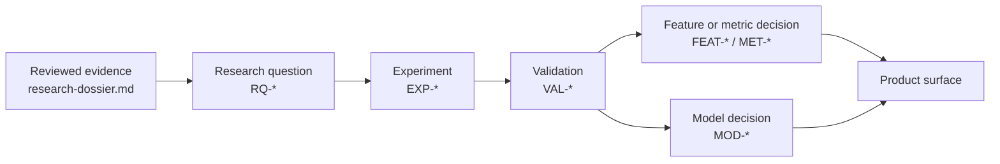

# ScoutLabs research

This directory is the research control plane for ScoutLabs. It separates reviewed
external evidence, governance, proposed experiments, specialist research plans, and
completed validations. It does not describe implemented product capability.

## Document map

| Document | Role | What belongs here |
|---|---|---|
| [Research dossier](research-dossier.md) | External literature research | The reviewed evidence base, source-to-recommendation matrix (`R1`–`R10`), and full bibliography. It is the primary external research foundation and is not duplicated here. |
| [Research methodology](research-methodology.md) | Research governance | Research questions, evidence hierarchy, reproducibility, lifecycle gates, review responsibilities, and policies for negative and AI-assisted work. |
| [Literature review](literature-review.md) | Concise synthesis | A method-by-method bridge from the dossier to local-data compatibility and planned experiments. |
| [Metric experiments](metric-experiments.md) | Experiment registry | The prioritized, versioned backlog. Every unexecuted experiment is `Planned` and has no result. |
| [Similarity research](similarity-research.md) | Similarity plan | Candidate populations, feature treatment, baseline distances, explanations, validation, and unresolved selection decisions. |
| [Spatial analysis](spatial-analysis.md) | Spatial and 360 plan | Event-coordinate representations and restricted, coverage-aware use of event-linked 360 snapshots. |
| [Validation results](validation-results.md) | Completed validations | Audit facts supported by an executed check, plus a clearly separate planned-validation queue. |

Related foundations:

- [Approved product direction](../../BRIEF.md)
- [Data documentation](../data/README.md)
- [Metric documentation](../metrics/README.md)
- [StatsBomb source notes](../data-source.md)

## Boundaries

- Provider-documented information, locally observed information, provider-supplied
  values, ScoutLabs-derived values, proposals, and completed validations remain
  distinguishable.
- A metric does not become a product metric because it appears in research.
- A model remains a proposal until it passes the gates in
  [research methodology](research-methodology.md).
- Similarity means statistical proximity under a recorded configuration. It does not
  mean quality, superiority, tactical fit, affordability, or transfer suitability.
- Event maps show recorded actions, not continuous player movement.
- StatsBomb 360 data consists of partial, event-linked snapshots, not tracking.

## Traceability

Stable identifiers are never recycled. The canonical prefixes are `RQ-`, `EXP-`,
`VAL-`, `SRC-`, `EVT-`, `DQ-`, `FEAT-`, `MET-`, and `MOD-`. Dossier recommendations
retain their existing `R1`–`R10` identifiers.

## Status vocabularies

- Evidence availability: `Documented`, `Observed`, `Documented and observed`,
  `Documented but not observed`, `Observed but not documented`.
- Metric maturity: `Proposed`, `Researching`, `Experimentally supported`,
  `Validated`, `Approved for MVP`, `Rejected`, `Deprecated`.
- Experiment status: `Planned`, `In progress`, `Completed`, `Rejected`, `Blocked`.
- Model status: `Proposal`, `Experimental`, `Candidate`, `Production`, `Deprecated`.

No experiment in the initial registry has been executed, and no metric or model is
automatically approved by these documents.
