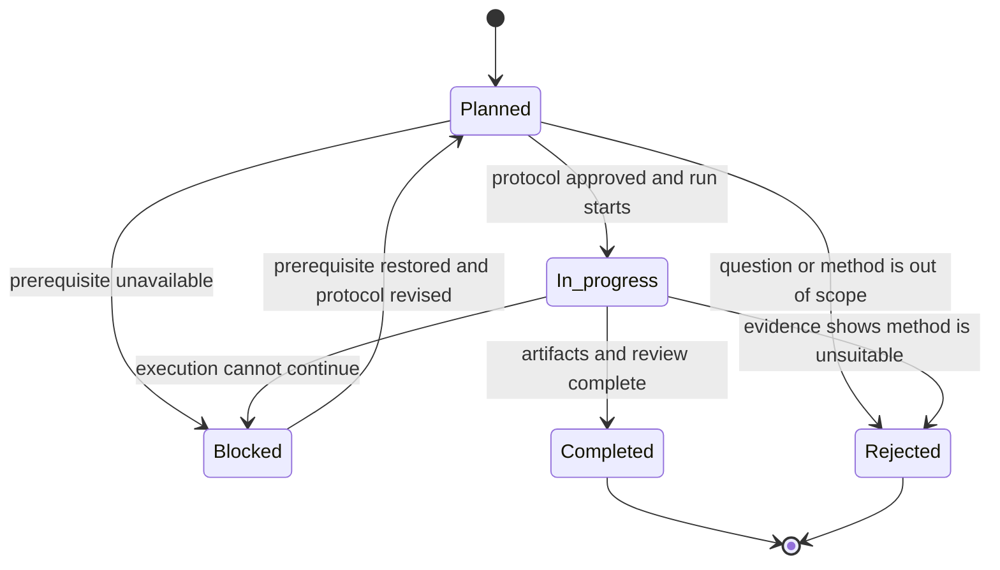

# Research methodology

**Scope:** ScoutLabs analytical research
**Governance version:** 1.0
**Status:** Active research policy
**Primary product authority:** [ScoutLabs Product Brief](../../BRIEF.md)
**Reviewed evidence foundation:** [Research dossier](research-dossier.md)

## 1. Objectives

ScoutLabs research must determine what the available StatsBomb Open Data can support
reproducibly and what it cannot support responsibly. The process has five objectives:

1. preserve traceability from source evidence to a football claim;
2. compare contested definitions against explicit baselines;
3. quantify coverage, stability, and failure modes before metric or model admission;
4. combine statistical testing with football review;
5. retain negative and inconclusive results.

Research does not authorize application implementation. It produces versioned evidence
for later product decisions under the scope and metric-admission criteria in the
[product brief](../../BRIEF.md#19-metric-admission-criteria).

## 2. Research-question registry

| Research question ID | Question | Primary evidence or experiment |
|---|---|---|
| `RQ-DATA-001` | Which documented and observed source fields have sufficient quality, coverage, and provenance for analytical use? | [Data documentation](../data/README.md); [completed snapshot validations and remaining planned checks](validation-results.md) |
| `RQ-MIN-001` | How can starts, entries, exits, extra time, dismissals, and interrupted matches support defensible player minutes? | `EXP-MIN-001` |
| `RQ-PASS-001` | Which StatsBomb outcomes and special cases define an interpretable pass-completion denominator? | `EXP-PASS-001` |
| `RQ-PROG-001` | Which versioned geometry best describes progressive actions and advanced-zone entries without importing a vendor label as football truth? | `EXP-PROG-001`, `EXP-ENTRY-001` |
| `RQ-CREATE-001` | Which event links support shot assists and ScoutLabs-derived expected assists from linked StatsBomb shot xG? | `EXP-XA-001` |
| `RQ-LOSS-001` | Which event taxonomy and sequence window produce an interpretable ball-loss measure? | `EXP-LOSS-001` |
| `RQ-SEQUENCE-001` | Which possession-sequence participation definition adds reproducible context without implying causal contribution? | `EXP-SEQUENCE-001` |
| `RQ-DEF-001` | Which recorded defensive actions and opportunity denominators can be compared without claiming complete defensive quality? | `EXP-DEF-001` |
| `RQ-GK-001` | Which goalkeeper event families, links, and denominators support a distinct profile and similarity path? | `EXP-GK-001`, `EXP-GK-002` |
| `RQ-NORM-001` | Which scaling and comparison-population rules provide stable, understandable feature values? | `EXP-SCALE-001` |
| `RQ-RELIABILITY-001` | How should minute thresholds, event denominators, shrinkage, and visible warnings represent sample reliability? | `EXP-THRESH-001`, `EXP-SHRINK-001` |
| `RQ-SIM-001` | Which transparent distance and feature treatment produces stable, decomposable nearest neighbours? | `EXP-DIST-001`, `EXP-REDUND-001`, `EXP-MISS-001`, `EXP-SIM-001` |
| `RQ-SIM-002` | Do candidate lists pass mechanical, stability, same-player, negative-control, and expert-review tests? | `EXP-SIM-002`, `EXP-SIM-003` |
| `RQ-SPATIAL-001` | Which event-derived spatial representations add stable information beyond direct metrics? | `EXP-SPATIAL-001`, `EXP-SPATIAL-002` |
| `RQ-360-001` | Which event-linked 360 frames are usable, and which partial-visibility features remain unbiased enough for research? | `EXP-360-001`, `EXP-360-002` |
| `RQ-VALUE-001` | Do xT or VAEP add calibrated, explainable recruitment value beyond direct and zone-entry features? | `EXP-XT-001`, `EXP-VAEP-001` |
| `RQ-EXPLAIN-001` | Which explanation structure lets an analyst reconstruct a ranking and recognize uncertainty? | `EXP-SIM-001`, `EXP-SIM-003` |

New questions require a unique `RQ-` identifier, an owner, a link to evidence, and a
decision about whether they are in the approved product scope. Existing identifiers are
never reassigned.

## 3. Evidence hierarchy

| Rank | Evidence type | Permitted use | Main caution |
|---:|---|---|---|
| 1 | Official StatsBomb specifications and source repository | Provider schema, semantics, provenance, and provider-stated limitations | Documentation does not prove local occurrence or coverage. |
| 2 | Complete local snapshot measurements | Local occurrence, types, relationships, coverage, and quality findings | Local observation does not establish universal provider behavior. |
| 3 | Original peer-reviewed method papers | Method definition, assumptions, and reported validation | Published success does not prove compatibility with this dataset or product. |
| 4 | Official or author-maintained implementations and documentation | Reproducible reference behavior and implementation assumptions | Software availability is not football validity. |
| 5 | Systematic reviews and strong professional research | Context, converging evidence, and known methodological risks | Provider conventions and practitioner labels may differ. |
| 6 | ScoutLabs experiments | Product-specific stability, incremental value, and explanation evidence | Results are bounded by the recorded snapshot and sample design. |
| 7 | Expert review and case studies | Football plausibility and workflow usefulness | Review must be structured; agreement is not objective ground truth. |
| 8 | Hypotheses, AI-assisted synthesis, and analogy | Generate questions and alternatives only | Cannot validate a field, metric, model, or football claim. |

The dossier's evidence levels remain canonical: Level A is provider or original
peer-reviewed evidence; Level B is official implementation, systematic review, or
strong professional evidence; Level C is a grounded ScoutLabs inference; Level D is an
unresolved hypothesis or immature method.

### Source-evaluation policy

- Prefer the provider specification for field meaning and the local audit for observed
  availability.
- Record both when a claim is `Documented and observed`; never infer one from the other.
- Preserve exact field names and JSON paths.
- Treat provider-supplied categorical logic, xG, and metadata as provider values.
- Label aggregations, geometric transformations, link traversal, and model outputs as
  ScoutLabs-derived.
- Record the dataset path, source commit, ScoutLabs commit, audit time, command, Python
  version, and applicable definition/model versions.
- A secondary source may explain context but cannot silently replace the primary
  definition.
- A claim with conflicting sources remains unresolved until the conflict is documented
  and reviewed.

## 4. Experiment lifecycle

The rendered label `In_progress` represents the required repository status
`In progress`.

An experiment may move from `Planned` to `In progress` only when it has:

- a stable `EXP-` ID and linked `RQ-` ID;
- a falsifiable hypothesis;
- source fields and quality dependencies;
- a fixed dataset snapshot and candidate population;
- inclusion, exclusion, and sample rules;
- a baseline and competing definitions;
- evaluation criteria chosen before inspecting the result;
- deterministic configuration or recorded random seeds;
- an output location that does not place generated data in Git.

It becomes `Completed` only when execution artifacts, result, limitations, decision,
and reviewer sign-off are recorded. `Blocked` identifies a concrete missing
prerequisite. `Rejected` records why the question or method should not proceed.

## 5. Reproducibility rules

Every run must preserve:

- source and ScoutLabs commits;
- dataset root and immutable snapshot description;
- Python and dependency versions;
- command and configuration;
- selected competition, season, match, team, position, and player populations;
- field, feature, metric, and model versions;
- comparison group, thresholds, denominators, scaling, weights, and missing-value policy;
- deterministic ordering, seeds, train/validation split logic, and resampling units;
- machine-readable outputs and a human-readable decision note;
- warnings, excluded records, and failed quality rules.

Large-file processing must be incremental. Temporary inspection scripts stay outside
`src/`, must not become dependencies, and must be removed after use. Generated audit
artifacts belong under ignored `reports/`.

## 6. Negative-result policy

Negative, null, unstable, and inconclusive findings are retained. A record must state:

- what was attempted;
- the predeclared criterion that was not met;
- whether the cause is data, method, sample, implementation, or football validity;
- whether the outcome rejects the hypothesis, blocks the run, or motivates a narrower
  follow-up;
- which product claim is prevented.

Changing the candidate population, metric definition, or evaluation criterion after
seeing a result creates a new experiment version or a new `EXP-` record. It does not
rewrite the original result.

## 7. Metric admission lifecycle

Only these metric maturity statuses are allowed:

`Proposed` → `Researching` → `Experimentally supported` → `Validated` →
`Approved for MVP`.

`Rejected` and `Deprecated` are terminal or review states, not shortcuts in the main
path.

| Transition | Minimum evidence |
|---|---|
| to `Proposed` | Football question, owner, source fields, draft formula, unit, denominator, intended use, and known limitation. |
| `Proposed` to `Researching` | Coverage audit plan, quality dependencies, competing definitions, comparison group, and linked planned experiment. |
| `Researching` to `Experimentally supported` | Completed reproducible experiment meeting its predeclared criteria, sensitivity analysis, and documented negative findings. |
| `Experimentally supported` to `Validated` | Independent calculation review, automated tests, stable coverage, edge-case evidence, football interpretation review, and traceable `VAL-` records. |
| `Validated` to `Approved for MVP` | Human product-owner approval, a defined product surface, explanation copy, warnings, monitoring policy, and scope confirmation. |
| any active status to `Rejected` | Evidence that the metric is invalid, redundant, misleading, unsupported, or outside scope; rationale retained. |
| any admitted status to `Deprecated` | A replacement, evidence change, or incompatibility; migration and historical-version policy recorded. |

No metric is automatically `Approved for MVP` during this documentation task. A dossier
recommendation describes research priority, not lifecycle admission.

## 8. Model admission lifecycle

Only these model statuses are allowed:

- `Proposal`: intended use, prohibited use, analytical unit, candidate population,
  candidate inputs, baselines, and risks are documented.
- `Experimental`: at least one approved protocol is being executed against fixed
  baselines; no product claim is implied.
- `Candidate`: completed experiments support mechanical correctness, stability,
  incremental value, explainability, and football plausibility.
- `Production`: human approval, reproducible artifacts, versioned inputs, automated
  validation, monitoring, rollback, and product warnings are in place.
- `Deprecated`: the model must not power new results; replacement and historical
  reproducibility are documented.

A model cannot become `Candidate` merely because its retrieval metrics improve. It also
needs candidate-pool sensitivity, missingness, sample, negative-control, explanation,
and expert-review evidence. `MOD-SIM-BASELINE-V0` remains `Proposal`.

## 9. Review and approval

| Responsibility | Required review |
|---|---|
| Data-quality owner | Confirms source paths, denominators, exclusions, local coverage, and `DQ-` outcomes. |
| Research owner | Pre-registers hypotheses, methods, baselines, and evaluation criteria; records all findings. |
| Football reviewer | Reviews interpretation, position compatibility, cases, false positives, and prohibited claims. |
| Engineering reviewer | Reviews reproducibility, transformations, tests, deterministic behavior, and versioning. |
| Product owner | Approves product relevance, wording, warnings, and any transition to `Approved for MVP` or `Production`. |

One person may hold multiple roles in an early project, but each review perspective must
be recorded. Disagreement is logged; it is not averaged into a false consensus.

## 10. Versioning and change control

- Source-field identities use stable `SRC-` IDs and exact JSON paths.
- Feature, metric, model, experiment, validation, and quality-rule definitions each
  carry their own version.
- Formula, denominator, population, scaling, weighting, or missingness changes require
  a version change.
- Re-running an unchanged protocol on a new snapshot creates a new run record under the
  same experiment version.
- Historical outputs retain the versions used to produce them.
- Identifiers are never recycled, even after rejection or deprecation.

## 11. AI-assisted research

AI may inventory candidate questions, summarize supplied sources, draft protocols,
identify inconsistencies, and generate review checklists. AI output is not evidence.
Before acceptance, a human reviewer must:

1. verify citations against the cited primary source;
2. verify every field and path against official documentation and/or the local audit;
3. reproduce numerical claims from retained artifacts;
4. check that provider values and ScoutLabs derivations are distinguished;
5. inspect assumptions, denominators, exclusions, and leakage risks;
6. reject unsupported tactical or causal interpretations;
7. approve any lifecycle transition.

Internal model assertions, generated prose, and unverified web summaries cannot create
`Observed`, `Validated`, `Approved for MVP`, `Candidate`, or `Production` evidence.
