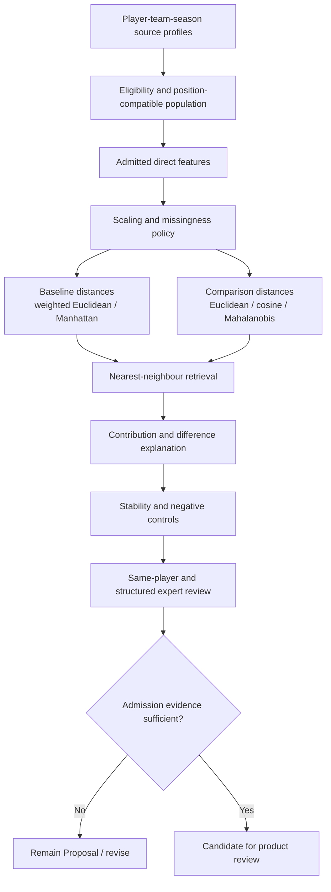

# Player-similarity research plan

**Model ID:** `MOD-SIM-BASELINE-V0`
**Model status:** `Proposal`
**Decision state:** no production algorithm selected
**Primary questions:** `RQ-SIM-001`, `RQ-SIM-002`, `RQ-EXPLAIN-001`

This plan formalizes research for explainable player retrieval under the
[ScoutLabs Product Brief](../../BRIEF.md). It inherits recommendations `R1`, `R3`,
`R6`, `R8`, `R9`, and `R10` from the
[research dossier](research-dossier.md). Similarity means statistical proximity within
a recorded analytical configuration. It is not player quality, superiority, tactical
fit, affordability, transfer advice, or a prediction of success.

## 1. Analytical unit

The default research unit is **player-team-season**:

```text
player_id + team_id + competition_id + season_id
```

This unit preserves the team context in which behavior occurred and avoids silently
combining transfers. Each profile must also carry:

- source player and team identifiers;
- competition and season identifiers;
- appearances, starts, raw playing seconds, and display minutes;
- position history and minutes by position when supportable;
- eligible event/action denominators;
- source and feature coverage;
- metric, feature, scaling, and model versions;
- partial-season, multi-team, mixed-position, and quality warnings.

### Combined and multi-team profiles

A player-season combined view is an optional analytical projection, not the canonical
unit. Research must compare:

1. separate player-team-season profiles;
2. a combined profile aggregated from raw numerators and denominators;
3. an exposure-weighted multi-team profile that retains each team share.

Rates must not be averaged without their denominators. A combined view must list every
team, minutes and event contributions per team, and any excluded small sample.
`EXP-SIM-002` and `EXP-SIM-003` will test whether the combined view helps exploration
without hiding role or context changes. No rule is selected here.

## 2. Candidate populations

The candidate universe is part of the model configuration, not an invisible query
detail. It must record:

- included competitions and seasons;
- position-compatible groups;
- goalkeeper/outfield separation;
- minimum minutes and event opportunities;
- included or excluded teams;
- treatment of mixed-position and multi-team profiles;
- data and feature coverage floors;
- cross-competition warnings;
- reference exclusion and deterministic tie-breaking.

### Position compatibility

Source positions are grouping evidence, not complete tactical roles. Candidate
population research should compare broad position families, narrower families, and
analyst overrides. Mixed-position eligibility may use primary-position share or
multi-label evidence, but the exact thresholds belong to `EXP-THRESH-001`,
`EXP-SIM-002`, and `EXP-SIM-003`.

An analyst may broaden a population, but the result must show that choice. Cross-position
negative controls test whether generic activity volume overwhelms football-specific
dimensions.

### Goalkeepers

Goalkeepers are excluded from the outfield baseline. Their shot-stopping, distribution,
area-action, sweeping, and opportunity structures differ enough to require separate
features and candidate groups. `EXP-GK-001` audits the source taxonomy and
`EXP-GK-002` compares a generic engine with a goalkeeper-specific configuration. No
goalkeeper algorithm is selected.

### Minimum samples

Per-90 conversion is not a reliability adjustment. Every query and candidate must expose
minutes, appearances, starts, and relevant action denominators. `EXP-THRESH-001` compares
position and metric-family thresholds; `EXP-SHRINK-001` compares raw values, shrinkage,
penalties, and visible warnings. Until those experiments are complete, the minimum-minute
policy is unresolved.

## 3. Feature space

The baseline research space should begin with admitted direct or transparently derived
features. Model-derived features are separate experimental channels.

| Dimension | Candidate direct/derived evidence | Candidate feature IDs | Research dependency |
|---|---|---|---|
| Availability | appearances, starts, minutes, minutes by position | `FEAT-APPEARANCE`, `FEAT-START`, `FEAT-MINUTES`, `FEAT-MINUTES-BY-POSITION` | `EXP-MIN-001`, `EXP-THRESH-001` |
| Passing | attempts, completed passes, completion, forward passing, type/context splits | `FEAT-PASS-ATTEMPT`, `FEAT-PASS-COMPLETED`, `FEAT-PASS-COMPLETION-RATE`, `FEAT-FORWARD-PASS` | `EXP-PASS-001`, `EXP-PROG-001` |
| Progression | progressive passes/carries, final-third and penalty-area entries | `FEAT-PASS-X-PROGRESSION`, `FEAT-PROGRESSIVE-PASS`, `FEAT-CARRY-X-PROGRESSION`, `FEAT-PROGRESSIVE-CARRY`, `FEAT-FINAL-THIRD-ENTRY`, `FEAT-PENALTY-AREA-ENTRY` | `EXP-PROG-001`, `EXP-ENTRY-001` |
| Creation | shot assists and linked-shot xA | `FEAT-SHOT-ASSIST`, `FEAT-DERIVED-XA` | `EXP-XA-001` |
| Carrying/security | carries, dribble attempts/outcomes, explicit/inferred losses | `FEAT-CARRY`, `FEAT-DRIBBLE-ATTEMPT`, `FEAT-DRIBBLE-SUCCESS`, `FEAT-BALL-LOSS` | `EXP-LOSS-001` |
| Shooting | shots, non-penalty shots, provider xG and non-penalty xG | `FEAT-SHOT`, `FEAT-NON-PENALTY-SHOT`, `FEAT-SHOT-XG`, `FEAT-NON-PENALTY-XG` | field/metric admission |
| Defending/pressing | pressures, counterpress, recoveries, interceptions, named event-location height | `FEAT-PRESSURE`, `FEAT-COUNTERPRESS`, `FEAT-BALL-RECOVERY`, `FEAT-INTERCEPTION`, `FEAT-DEFENSIVE-ACTION-HEIGHT` | `EXP-DEF-001` |
| Sequence | participation in declared possession/shot-ending sequences | `FEAT-POSSESSION-PARTICIPATION` | `EXP-SEQUENCE-001` |
| Spatial | action zones, family histograms, pass/carry transition routes | `FEAT-ACTION-ZONE`, `FEAT-SPATIAL-HISTOGRAM`, `FEAT-ZONE-TRANSITION` | `EXP-SPATIAL-001`, `EXP-SPATIAL-002` |
| Possession value | xT or VAEP enrichments | `FEAT-XT-ACTION-VALUE` and other proposed model outputs, not source fields | `EXP-XT-001`, `EXP-VAEP-001` |
| 360 context | nearest visible opponent and visible numerical balance | `FEAT-360-NEAREST-OPPONENT`, `FEAT-360-NUMERICAL-BALANCE` | `EXP-360-001`, `EXP-360-002` |

Availability is primarily an eligibility and reliability layer; it should not create
false behavioral similarity merely because two players both played many minutes.
Provider xG remains a provider value. xT, VAEP, and 360 context cannot enter the direct
baseline until their own experiments establish compatibility, stability, and coverage.

### Direct metrics versus model features

Direct metrics answer named football questions and should remain visible beside any model
input. Model features may transform, rescale, or combine them, but the model manifest
must retain:

```text
source field -> normalized feature -> metric/model input -> weighted contribution
```

Model inputs may be family summaries to support the product's initial dimension-level
control. Individual-metric weighting remains a comparison experiment, not a product
decision.

## 4. Preprocessing questions

### Scaling and normalization

`EXP-SCALE-001` compares:

- z-scores within a named candidate population;
- robust median/IQR scaling;
- percentiles;
- justified transforms for heavily skewed features;
- family-level aggregation.

Percentiles may be useful for display but lose gap magnitude and change when the
comparison population changes. Every fitted transformation must be versioned with the
population used to fit it. Transformations must not use a future test cohort when a
time-aware evaluation is intended.

### Redundancy

Correlated features can multiply one football behavior's influence. `EXP-REDUND-001`
combines statistical diagnostics with domain review:

- pairwise and rank correlations;
- variance/covariance diagnostics;
- PCA for internal diagnosis;
- leave-one-feature and leave-one-family-out ablation;
- conceptual overlap review.

PCA components are not presumed to be user-facing football dimensions.

### Weighting

Candidate weight schemes are:

- uniform features;
- uniform analytical families;
- position-family defaults;
- analyst-modified family weights;
- covariance-aware treatment as a comparison.

Weights must be non-negative unless a separately justified model requires otherwise,
normalized by a declared convention, and shown in the result. The model must expose how
the ranking changes under small perturbations. Default weights cannot be selected solely
from a visually appealing case.

### Missing values

Missing fields are never zero by default. `EXP-MISS-001` compares:

- excluding a feature family;
- excluding a candidate below a coverage floor;
- calculating on the common feature set;
- renormalizing with an explicit coverage penalty;
- using a missingness indicator;
- statistically defensible imputation.

The system must distinguish:

- football zero;
- source field not applicable;
- field or file not observed;
- quality-rule exclusion;
- insufficient sample;
- unavailable 360 coverage.

The explanation must name omitted dimensions, effective weight, and the coverage
penalty. A candidate must not gain similarity merely by lacking a feature on which it
would differ.

## 5. Candidate similarity methods

| Method | Strength | Main risk | Planned role |
|---|---|---|---|
| Euclidean distance | Simple and decomposable | Squared differences magnify outliers; redundancy double-counts | Comparator in `EXP-DIST-001` |
| Weighted Euclidean distance | Direct family/analyst weights; highly decomposable | Arbitrary weights and correlated inputs | Baseline candidate |
| Manhattan distance | Decomposable; less dominated by one extreme feature | Still scale- and redundancy-sensitive | Baseline candidate |
| Cosine similarity | Compares profile shape | Can ignore meaningful level differences; missingness is awkward | Comparator |
| Mahalanobis distance | Accounts for covariance | Unstable covariance in small cohorts; harder weights/explanations | Comparator |
| Nearest-neighbour retrieval | Natural reference-player workflow | Does not itself validate the feature space | Retrieval wrapper around every distance |
| PCA space | Redundancy diagnosis and visualization | Components are not intrinsically football concepts | Internal diagnostic only |
| Clustering | Exploratory archetypes and cohort checks | Unstable/opaque clusters can be mistaken for roles | Research only |
| Learned embeddings | Potential nonlinear representation | Data demand and weak decomposition | Research only |
| Statistical-spatial hybrid | Can distinguish equal totals in different locations | Duplicate information, sparse samples, explanation complexity | Additive experiment |

Weighted Euclidean and Manhattan are baseline candidates, not selected winners.
Euclidean, cosine, and Mahalanobis must be evaluated on the same fixed feature and
candidate sets. The retrieval implementation must preserve deterministic ties and return
the recorded candidate universe, not only the top-k players.

## 6. Research flow



The `Yes` branch does not imply `Production`; it permits a later human review against
the model-admission gates.

## 7. Retrieval output and explanation

Every research result must include:

1. reference player, team, competition, season, positions, minutes, and coverage;
2. complete candidate filters and effective candidate count;
3. feature, metric, scaling, distance, weight, missingness, and model versions;
4. overall distance or transformed similarity with no false precision;
5. family-level contributions;
6. strongest metric-level similarities;
7. strongest metric-level differences;
8. unavailable or excluded features and coverage effect;
9. sample, competition, positional, spatial, and 360 warnings;
10. model order preserved separately from any later analyst order.

For weighted Euclidean, squared weighted differences must reconcile with total squared
distance. For Manhattan, weighted absolute differences must reconcile with total
distance. Any transformation from distance to a presentation score must be monotonic,
versioned, and separately explained.

The explanation must never claim why a player behaved a certain way. It describes
recorded statistical differences and known data limitations.

## 8. Model versioning

The model manifest for `MOD-SIM-BASELINE-V0` must contain:

- model ID, version, status, owner, timestamp, and code commit;
- immutable data snapshot and source commit;
- analytical-unit and combined-profile policy;
- candidate-population definition;
- feature and metric versions;
- threshold and denominator rules;
- scaling fit and population;
- distance, weights, and tie-breaking;
- missingness and coverage policy;
- excluded experimental channels;
- explanation schema;
- validation artifacts and known failures.

Changing feature membership, transformation, weight defaults, distance, missingness,
candidate rules, or score mapping requires a new model version. A rerun on a new dataset
snapshot retains the model version but receives a new run manifest only when the
configuration is unchanged.

## 9. Validation plan

No single test establishes football validity. The required gates are:

| Gate | Evidence | Experiments |
|---|---|---|
| Source correctness | Admitted metrics/features, valid lineage, coverage and quality outcomes | Priority 1 audits and completed `VAL-*` records |
| Mechanical correctness | Reproducible ranking, deterministic ties, contribution reconciliation | `EXP-SIM-001` |
| Preprocessing sensitivity | Scaling, redundancy, missingness, and coverage comparisons | `EXP-SCALE-001`, `EXP-REDUND-001`, `EXP-MISS-001` |
| Distance sensitivity | Same candidates/features across transparent methods | `EXP-DIST-001` |
| Sample stability | Minute checkpoints, match bootstrap, fixture removal | `EXP-THRESH-001`, `EXP-SHRINK-001`, `EXP-SIM-002` |
| Population sensitivity | Position and competition universe changes | `EXP-SIM-002`, `EXP-SIM-003` |
| Positive/negative controls | Same-player seasons, synthetic perturbations, randomized/incompatible profiles | `EXP-SIM-002` |
| Football review | Preregistered cases, structured expert ratings, disagreement log | `EXP-SIM-003` |
| Incremental channels | Direct baseline versus value/spatial/360 enrichment | `EXP-XT-001`, `EXP-VAEP-001`, `EXP-SPATIAL-001`, `EXP-SPATIAL-002`, `EXP-360-002` |
| Goalkeeper separation | Generic versus goalkeeper-specific feature/retrieval path | `EXP-GK-002` |

A model can remain a useful research baseline after failing a product gate. The failure
and prohibited use must remain documented.

## 10. Baseline candidates

The initial comparison must include:

- scaled, family-weighted Euclidean distance;
- scaled, family-weighted Manhattan distance;
- unweighted Euclidean as a mechanical comparator;
- cosine as a profile-shape comparator;
- Mahalanobis as a covariance-aware comparator where cohort size permits.

Nearest-neighbour retrieval wraps each distance. No production algorithm is selected.
PCA, clustering, embeddings, and statistical-spatial hybrids remain diagnostics or
experiments.

## 11. Experiments required before selection

At minimum:

`EXP-MIN-001`, `EXP-PASS-001`, `EXP-PROG-001`, `EXP-ENTRY-001`,
`EXP-XA-001`, `EXP-LOSS-001`, `EXP-DEF-001`, `EXP-SEQUENCE-001`,
`EXP-SCALE-001`, `EXP-DIST-001`, `EXP-REDUND-001`, `EXP-MISS-001`,
`EXP-THRESH-001`, `EXP-SHRINK-001`, `EXP-SIM-001`, `EXP-SIM-002`, and
`EXP-SIM-003`.

Spatial, action-value, 360, and goalkeeper channels additionally require their named
experiments before inclusion.

## 12. Decision criteria

A candidate method may advance from `Proposal` only if it:

- is reproducible from a complete manifest;
- passes mechanical and lineage checks;
- remains acceptably stable under sample, scaling, weight, and population perturbations;
- avoids hidden missingness and coverage advantages;
- rejects preregistered negative controls;
- produces decomposable explanations;
- adds recruitment-screening value over a simpler baseline;
- has documented expert agreement and disagreement;
- preserves visible uncertainty and prohibited interpretations;
- fits the approved MVP boundary.

## 13. Known risks

- Team tactics, teammates, opponents, and game state confound player outputs.
- Position labels do not fully observe roles.
- Historical Open Data is a selective candidate universe.
- Cross-competition comparisons lack league-strength adjustment.
- Low minutes and rare events destabilize profiles.
- Correlated metrics can create artificial agreement.
- Missing fields and partial 360 coverage can bias distances.
- One attractive case can drive post-hoc features or weights.
- Similarity-score presentation can imply false precision.
- Expert review can encode reputation and confirmation bias.
- A stable algorithm can still answer the wrong recruitment question.

## 14. Unresolved questions

1. Which position families and mixed-position thresholds are useful?
2. When should a combined multi-team profile be eligible?
3. Which metric families and weights belong in each position configuration?
4. Which scaling and distance pair best balances stability and explanation?
5. How should missing-feature renormalization and coverage penalties interact?
6. Which minimum-minute and event-denominator rules apply by family?
7. Does shrinkage improve decisions enough to justify its complexity?
8. Should statistical and spatial similarity remain separate scores?
9. Can xT or VAEP add non-redundant value?
10. Can partial 360 context enter any aggregate without coverage bias?
11. How should ranking instability be communicated?
12. What constitutes sufficient and diverse expert review?
13. Does goalkeeper similarity require a wholly separate model?

These questions remain open until the linked experiments are completed and reviewed.
