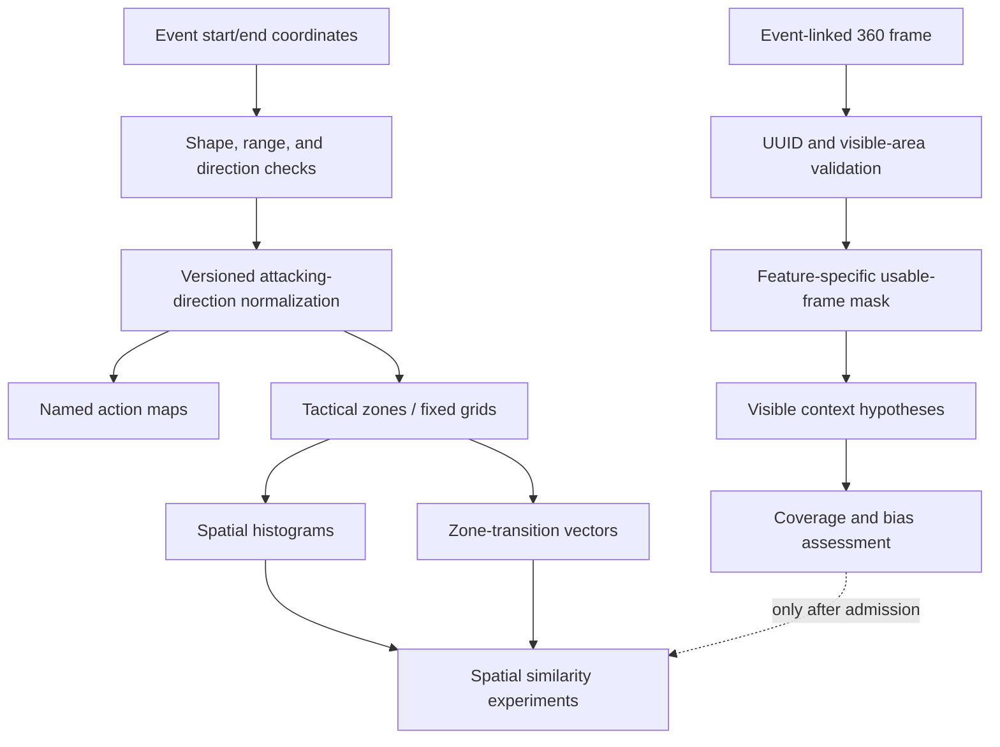

# Spatial and 360 analysis plan

**Plan version:** 1.0
**Status:** Research plan
**Primary questions:** `RQ-SPATIAL-001`, `RQ-360-001`
**Evidence:** [Research dossier](research-dossier.md),
[StatsBomb data specifications](../../data/statsbomb-open-data/doc/StatsBomb%20Open%20Data%20Specification%20v1.1.pdf),
and [360 specification](../../data/statsbomb-open-data/doc/Open%20Data%20360%20Frames%20v1.0.0%20%281%29.pdf)

Spatial analysis in ScoutLabs describes where recorded events occur and how recorded
actions move the ball. Event maps are not tracking heatmaps. StatsBomb 360 frames are
partial, event-linked snapshots, not a continuous tracking feed.

## 1. Coordinate contract

StatsBomb event coordinates use a nominal 120-by-80 pitch:

- x-axis: `0` to `120`;
- y-axis: `0` to `80`;
- source locations may be absent or conditional;
- two-dimensional event locations and some event-specific end locations must be
  validated before use;
- shot end locations can contain a third coordinate and require a separate shape rule;
- coordinate boundary conventions must be versioned.

The [data-quality rules](../data/data-quality-rules.md) govern shape and range checks
through `DQ-COORD-SHAPE` and `DQ-COORD-RANGE`. Invalid coordinates are excluded from
the relevant spatial denominator and counted; they are not clipped silently.

### Attack-direction normalization

All player attacking representations must share one direction: own goal at x=0,
opponent goal at x=120. The StatsBomb representation is generally oriented this way for
the team associated with the event, and the 360 specification describes locations in
the actor team's attacking orientation. Research must still verify assumptions by event
family and never infer direction from a player's identity alone.

The canonical transformation is a versioned function:

```text
normalize(location, orientation_evidence, coordinate_version)
    -> normalized_location | unavailable_with_reason
```

If a source needs a 180-degree rotation:

```text
x' = 120 - x
y' = 80 - y
```

If coordinates are normalized for modeling:

```text
u = x / 120
v = y / 80
```

Raw provider coordinates remain preserved. Pixel conversion is a visualization concern,
not a new football coordinate:

```text
pixel_x = u * rendered_pitch_width
pixel_y = v * rendered_pitch_height
```

Transformation version, orientation evidence, and excluded locations must remain in
lineage.

## 2. Tactical zones and fixed grids

ScoutLabs should compare a small number of declared representations rather than treat
one grid as tactical truth.

### Tactical zones

A versioned tactical-zone scheme may include:

- defensive, middle, and attacking thirds;
- penalty areas;
- central, half-space, and wide lanes;
- selected attacking subzones;
- goalkeeper-specific zones.

Every zone must specify inclusive/exclusive boundaries, direction, overlaps, and how a
point on a boundary is assigned. Final-third and penalty-area entries require origin
outside and end inside under the candidate baseline in `EXP-ENTRY-001`.

### Fixed grids

Fixed grids support `FEAT-SPATIAL-HISTOGRAM` and research comparisons. Candidate
resolutions should be preregistered in `EXP-SPATIAL-001`. Finer grids provide detail but
increase sparsity and positional noise; coarse grids improve stability but can merge
football-distinct areas.

Grid cells are operational bins, not observed tactical roles. Cell order and pitch
orientation are part of the feature version.

## 3. Event-derived maps

| Map | Source geometry | Responsible label | Main limitation | Candidate features/experiments |
|---|---|---|---|---|
| Action map | `events[].location` filtered to a named event family | “Recorded [family] locations” | Activity only, not occupation | `FEAT-ACTION-ZONE`, `EXP-SPATIAL-001` |
| Pass map | pass start and `events[].pass.end_location` | “Pass start/end map” | Attempts and outcomes must be distinguished | `FEAT-PASS-X-PROGRESSION`, `FEAT-ZONE-TRANSITION`, `EXP-PROG-001`, `EXP-SPATIAL-002` |
| Carry map | carry start and `events[].carry.end_location` | “Carry start/end map” | Provider carry event semantics, not all movement | `FEAT-CARRY-X-PROGRESSION`, `FEAT-ZONE-TRANSITION` |
| Shot map | shot start, outcome, xG, and shot end location where usable | “Shot map” | Shot activity and provider xG, not continuous attacking occupation | `FEAT-SHOT`, `FEAT-SHOT-XG`, `EXP-SPATIAL-001` |
| Pressure map | Pressure event start location | “Recorded pressure locations” | Not complete pressure intensity or team press shape | `FEAT-PRESSURE`, `FEAT-DEFENSIVE-ACTION-HEIGHT`, `EXP-DEF-001` |
| Recovery map | Ball Recovery event location | “Recorded recovery locations” | Provider-recorded interventions only | `FEAT-BALL-RECOVERY`, `FEAT-DEFENSIVE-ACTION-HEIGHT` |
| Interception map | Interception event location | “Recorded interception locations” | Outcome/taxonomy rules remain relevant | `FEAT-INTERCEPTION`, `FEAT-DEFENSIVE-ACTION-HEIGHT` |
| Reception approximation | pass endpoint and recipient, when present | “Pass-receipt approximation” | Not continuous off-ball positioning; endpoint may differ from first controlled touch | `FEAT-ACTION-ZONE`, `EXP-SPATIAL-001` |

Maps must include event count, match count, minutes, source/quality exclusions, and any
normalization. Outcome and action-type filters remain visible. A smoothed map must never
hide a small sample.

## 4. Spatial summaries

### Event centroids, width, and depth

Means, medians, and robust spreads can summarize the locations of a named event family:

- median pass-start x;
- median pressure x;
- interquartile y-span of recoveries;
- x/y centroid of shot locations.

The feature name must include its event family. Generic “average position,” team width,
or player depth would imply continuous positioning and is prohibited. Outliers, pitch
boundaries, and low counts must be visible.

### Spatial histograms

`FEAT-SPATIAL-HISTOGRAM` represents the share or rate of a named action family in each
versioned zone/cell. Candidate normalizations include:

- within-family share, answering “where does this player's recorded activity occur?”;
- per-90 cell rates, mixing location with activity volume;
- opportunity-conditioned shares where the denominator has clear football meaning.

The chosen representation must preserve the denominator. A within-family share cannot
support a volume claim.

### Kernel density estimation

KDE may provide a smoother visualization, but research must record:

- kernel and bandwidth;
- coordinate scaling;
- pitch-boundary correction or reflection;
- sample-size floor;
- whether density integrates over the valid pitch;
- sensitivity to bandwidth and match resampling.

KDE remains a visualization or research representation. It is not the default similarity
feature unless `EXP-SPATIAL-001` shows stability and incremental value.

### Zone transitions

`FEAT-ZONE-TRANSITION` represents named start-zone to end-zone movements for passes and
carries. Pass and carry channels should remain separate before any combined vector.
Candidate normalization includes raw counts, per-90 rates, and within-family transition
shares. `EXP-SPATIAL-002` tests sparse-cell handling, sample stability, cosine/Manhattan
distances, and redundancy with progression and entry metrics.

### Spatial similarity

Candidate representations and distances are:

- tactical-zone share vectors;
- fixed-grid histograms;
- separate event-family channels;
- start-to-end transition vectors;
- centroid and robust-spread descriptors;
- KDE or distribution-aware distances as research comparators;
- cosine, Manhattan, and distribution-aware distances.

Spatial similarity begins as a separate, additive channel. Combining it with statistical
similarity requires ablation, explicit weights, contribution explanations, and evidence
that it does not duplicate direct metrics.

## 5. Sample stability and boundary effects

Every representation must be recalculated under:

- increasing minutes and action counts;
- match bootstrap/resampling;
- fixture removal;
- alternate grid resolution or zone boundary;
- KDE bandwidth changes where applicable;
- position-compatible populations;
- alternative successful/attempt action filters.

Boundary risks include:

- coordinate values exactly on zone edges;
- penalty-area and third-line inclusivity;
- density leaking outside the pitch;
- fixed-grid discontinuity when a small coordinate change crosses a cell;
- sparse transition cells;
- differing coordinate shape for shot endpoints.

`EXP-SPATIAL-001` and `EXP-SPATIAL-002` must predeclare thresholds for acceptable
stability. If no representation meets them, spatial similarity remains unadmitted while
direct action maps may still be useful visualizations.

## 6. StatsBomb 360

The full audit found 426 three-sixty files in the 3,961-match snapshot: 425 parsed
and one is invalid JSON. Structural checks are complete (`VAL-360-001` through
`VAL-360-003`): 1,357,627 of 1,381,467 frame UUIDs resolve to an event
(98.274298%), every parsed visible-area polygon passed the measured shape,
finite-coordinate, range, non-zero-area, and explicit-closure checks, and the
flag audit retained the observed actor/keeper anomalies. Whether that coverage
is representative and usable for particular features remains a question for
`EXP-360-001`; the completed checks do not admit a 360 feature.

### Source semantics

An open 360 record can provide:

- `three-sixty[].event_uuid`;
- `three-sixty[].freeze_frame[].location`;
- `three-sixty[].freeze_frame[].teammate`;
- `three-sixty[].freeze_frame[].actor`;
- `three-sixty[].freeze_frame[].keeper`;
- `three-sixty[].visible_area[]`.

Only visible players are represented. The data does not identify non-actor players.
An absent player may be outside the camera-visible polygon rather than absent from the
football situation. Event-linked frames do not describe movement before or after the
event.

### Visible-area polygons

`DQ-VISIBLE-AREA-POLYGON` governs shape and validity. A feature must define whether:

- a polygon exists and is non-empty;
- it is geometrically usable;
- the actor lies inside or near the visible area;
- the feature's search radius or target zone is sufficiently visible;
- partial visibility requires exclusion rather than a zero.

A visible player count without a visibility condition is not comparable across frames.

### Actor and player labels

The actor flag locates the event actor where correctly supplied. Teammate/opponent is
relative to that actor's team. Goalkeeper labels identify visible keepers where supplied.
Rare absent or inconsistent flags are quality states. ScoutLabs must not infer the
identity of a non-actor, attribute its later actions to the snapshot, or construct
player-specific off-ball metrics from anonymous visible locations.

### Proposed 360 features

| Feature or hypothesis | Definition boundary | Usable-frame requirement | Research link |
|---|---|---|---|
| `FEAT-360-NEAREST-OPPONENT` | Euclidean pitch distance from actor to nearest **visible** opponent | Resolved event, valid actor/opponent locations, actor present, required search region adequately visible | `EXP-360-001`, `EXP-360-002` |
| `FEAT-360-VISIBLE-SUPPORT` | Count/distance of visible teammates within a versioned radius | Actor present and local radius sufficiently visible | `EXP-360-001`, `EXP-360-002` |
| Visible opponent density | Visible opponents within a versioned radius or kernel | Actor present and local area sufficiently visible | `EXP-360-002` |
| `FEAT-360-NUMERICAL-BALANCE` | Visible teammates minus visible opponents in a versioned local region | Comparable visible region and valid team labels | `EXP-360-001`, `EXP-360-002` |
| Visible passing-option hypothesis | Teammate falls inside a declared distance/angle/obstruction rule | Actor and teammate locations valid; relevant corridor inside visible area | `EXP-360-002` |
| Approximate visible pressure context | Distance/density category based on visible opponents | Must be labelled approximate; compare with `events[].under_pressure` | `EXP-360-002` |

Terms such as “visible,” “local,” and “approximate” are part of the feature meaning.
Nearest visible opponent is not nearest opponent on the pitch. Local visible numerical
balance is not team numerical superiority.

### Usable-frame criteria

`EXP-360-001` must produce feature-specific masks. A generic candidate frame requires:

1. readable JSON with the expected root;
2. event UUID resolving to exactly one local event;
3. valid freeze-frame coordinate shapes/ranges;
4. a usable visible-area polygon where the feature depends on absence or radius;
5. an actor where actor-centered geometry is required;
6. consistent teammate/opponent and goalkeeper flags for the relevant feature;
7. no source-quality failure that invalidates the calculation.

A feature may impose stricter visibility. Exclusions and their denominators are retained.

### Coverage bias

360 coverage is partial by match, competition-season, event type, camera view, and
therefore player. A proposed aggregate must report:

- eligible source events;
- linked frames;
- usable frames for that feature;
- usable share;
- covered matches and competition-seasons;
- player/team/position distribution;
- visible-area rejection reasons;
- whether coverage correlates with the target or ranking.

`EXP-MISS-001` and `EXP-360-002` must show that missing 360 is not zero context.
Sparse 360 features remain outside global similarity unless a preregistered coverage
floor and penalty survive bias/stability review.

### Prohibited 360 claims

ScoutLabs must not claim:

- continuous tracking or complete team shape;
- all 22 players are present;
- non-actor identity;
- complete passing options;
- closing speed, body orientation, or true pressure intensity;
- off-ball player attribution;
- proprietary commercial StatsBomb 360 metrics.

No proprietary commercial 360 metric is available from these open raw frames.

## 7. Analytical flow



## 8. Decision gates

Direct action maps may advance only with correct labels, valid coordinates, visible
denominators, and source-to-feature lineage. A spatial similarity channel additionally
needs completed `EXP-SPATIAL-001` and `EXP-SPATIAL-002` evidence.

A 360 feature additionally needs completed link, polygon, flag, coverage, stability, and
bias validations plus `EXP-360-001` and `EXP-360-002`. Until those gates pass, all 360
features remain proposals for internal research.
